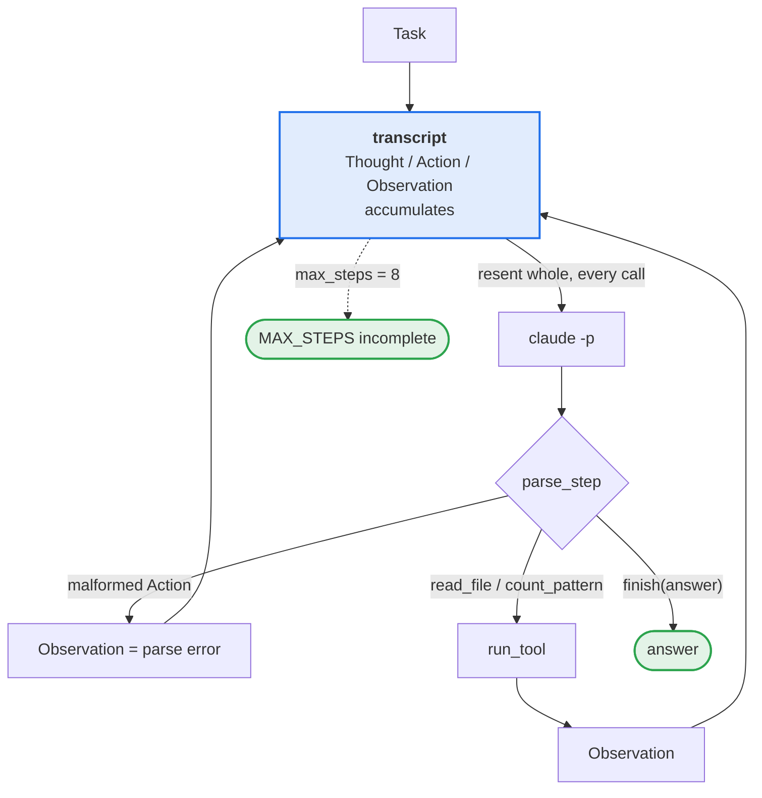
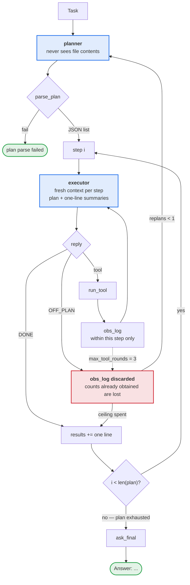

# Week 02 — Harness A/B: ReAct vs Plan-then-Execute

The model, the task, and the tools are held constant. Only the harness varies.

## 1. Variant definition

**What is held constant.** Anyone re-running this needs all of it, and none of it
differs between the two harnesses.

| | |
|---|---|
| Model | Claude Sonnet 5 (`claude-sonnet-5`) |
| Call path | `claude -p`, authenticated by a Claude subscription. No API key. |
| Runtime | `claude` CLI **2.1.251**; Python 3.13, standard library only — nothing to install. The per-call overhead measured in part 2 is a property of this CLI version. |
| Harnesses | `harness_react.py`, `harness_plan_execute.py`, sharing `tools_shared.py`. `probe_overhead.py` measures the overhead; `run_ab.py` drives the runs and writes the conditions header into each log. |
| Fixed flags | `--output-format json --allowed-tools "" --system-prompt <per-harness> --exclude-dynamic-system-prompt-sections --strict-mcp-config --mcp-config '{"mcpServers":{}}'` |
| Tools | `read_file(path)` → file contents, first 4000 chars. `count_pattern(path, pattern)` → number of matching lines. Both harnesses import them from `tools_shared.py`. |
| Task | the `task:` line of `TASK.md`, committed in `edbdb8a` before the first run and unchanged since |
| Success | the `expected:` line `14:00` appears in the final answer (`run_ab.py:judge`) |
| Input | `app.log`, unchanged. Hour 14 has 6 ERROR lines, the maximum; hour 12 is second with 3. |

```bash
cd submissions/25520014/week-02
python run_ab.py --runs 3      # writes results.csv and logs/
```

`--allowed-tools ""` is what protects the controlled variable. Without it the
model reaches `app.log` through Claude Code's own Read/Bash instead of ours and
"same tools" stops being true; every file access in the logs goes through
`[tool] read_file(...)`.

One property of this call path shapes both harnesses. `claude -p` returns text,
not `tool_use` blocks, so each harness parses `Action: {"tool": ..., "args":
{...}}` itself and runs the tool. The original ReAct paper worked this way too,
and it adds a failure mode the API path does not have — a malformed `Action`
line. It did not occur in these six runs.

**What differs.** Elements 1, 3, and 4 of the five. Element 2 is the control.

| Element | ReAct | Plan-then-Execute |
|---|---|---|
| **1. Context** | One `transcript` list. Thought/Action/Observation are appended and the **whole thing** is resent on every call. | **Split into two roles.** The planner sees only the task and the tool list, never file contents. The executor is a fresh call per step, receiving the plan, the current step, and a **one-line summary** of earlier steps. Earlier Thoughts and raw Observations do not carry over. |
| **2. Tool granularity** | `read_file`, `count_pattern` | **Identical.** Fixed in `tools_shared.py`. |
| **3. Termination** | The model must call `finish(answer)` **explicitly**. `max_steps=8` on top. | **Plan exhaustion.** An answer found mid-plan does not stop the loop, and there is no `finish`. `max_tool_rounds=3` per step on top. |
| **4. Error recovery** | One layer. Tool exceptions and parse failures come back as Observations. | Two layers. Same inside a step; a blocked step emits `OFF_PLAN` and escalates **to the planner**, which rewrites the remaining steps. `max_replan=1` is the flexibility ceiling. |
| **5. Human intervention** | `IRREVERSIBLE` gates tools before execution. The set is empty. | Same hook, same empty set. |

Element 5 never fired, because every tool is read-only. The zeros in the
`interventions` column are not a tie between the harnesses; they mean this task
could not measure that element at all.





## 2. Measurements

| run | harness | success | tokens | adj. tokens | iters | interventions | note |
|---|---|---|---|---|---|---|---|
| 1 | react | O | 114,103 | 4,471 | 3 | 0 |  |
| 2 | react | O | 75,376 | 2,288 | 2 | 0 |  |
| 3 | react | O | 114,140 | 4,508 | 3 | 0 |  |
| 4 | plan_exec | X | 524,627 | 50,387 | 13 | 0 | replans=1 |
| 5 | plan_exec | X | 910,242 | 107,682 | 22 | 0 | replans=1 |
| 6 | plan_exec | X | 523,769 | 49,529 | 13 | 0 | replans=1 |

Every column but `adj. tokens` is `results.csv` verbatim. That one is derived,
because `tokens` cannot be read as it stands: `claude -p` loads Claude Code's own
system prompt and built-in tool definitions on every call — a fixed 36,480
tokens, measured per harness with `probe_overhead.py` — so most of each raw
figure is a constant rather than conversation. `adj. tokens` subtracts it
(`tokens − iters × 36,480`), averaging 3,756 for ReAct against 69,199 for
Plan-then-Execute: an **18.4× gap the raw numbers hide**, where raw they show
6.5×, which merely restates the 6.0× iteration ratio and conceals that
Plan-then-Execute also spends 3× more per call.

Variance is the asymmetric part. ReAct lands within 2–3 iterations every time,
while Plan-then-Execute spreads over 13, 22, 13. Run 05 is the outlier: its
replan produced a binary-search strategy that grew the plan from 4 steps to 7,
and each added step was another chance to hit the per-step ceiling. The runs fail
in the same place but not at the same price.

`logs/` holds one file per row above. Observations in them are cut at 200
characters, as in the starter; only `read_file` is long enough to be cut and
Thought lines are never cut. Whether the model really saw the whole file is
still checkable from those: the second Thought in `logs/react-02.txt` lists the
14:00-hour ERROR timestamps as `14:04, 14:07, 14:15, 14:30, 14:47, 14:54`, which
matches `app.log` exactly, while the surviving first 200 characters contain only
09:00-hour lines.

## 3. Interpretation

ReAct won on every metric that moved — 3/3 against 0/3, 6.0× fewer iterations,
18.4× fewer adjusted tokens — but the cause is not element 3 by itself: it is
**whether element 1 left element 3's ceiling reachable.** At 3,022 bytes
`app.log` fits `read_file`'s 4,000-character cap, so ReAct's single `transcript`
keeps all 60 lines and runs 02 and 03 never called `count_pattern` at all
(`logs/react-02.txt`). Plan-then-Execute compresses the same content into one
`DONE:` line, leaving its per-step executor nine `count_pattern` calls to make
against a ceiling of 3 — and `OFF_PLAN` discards whatever the step already
counted, so a correct `-> 1` still became "no data to compare"
(`logs/plan_exec-04.txt`). All three runs died at the same step of the
same plan for the same reason, so it is structural, not accidental. Element 4 fired every time
and the planner even learned the ceiling existed — run 04's replan says *"call
them one hour at a time so as not to exceed the tool-call limit"* — yet never
moved those nine counts out of one step, element 1 having cut it off from
execution reality. The verdict is conditional: the input fit in context, exactly
when accumulating everything is pure gain; with a larger file that same element
becomes the liability. These runs show not which harness is better but that
element 1 decides whether element 3's ceiling binds at all.
